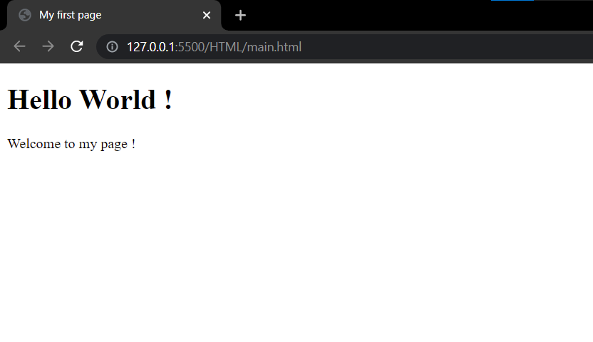

# HyperText Markup Language (HTML)

## Table of contents 
* Introduction
* HTML5
  * Basic Webpages
  * HTML elements

## Introduction
Hypertext Markup Language is know under the name HTML. The document is structered by elements having names sourounded by "&#60;" and "&#62;" such as `<head>`<sup>1</sup>. The language was made in order to load webpages on your browser and can be assisted by CSS, and Javascript<sup>2</sup>. The file extension for writing HTML is `.html` or `.htm`<sup>3</sup>, and is currently on version 5, or HTML5<sup>4</sup>.

## HTML5 
HTML5, as mentionned previously is the current version of HTML, released on October 28 2008, having a major update with the W3C recomendations in october of 2014<sup>5</sup>. Now we are going to discuss of the actual structure of the HTML that is written and displayed on the web. First, the tags. They are composed of an **opening tag**, **a content**, and **a closing tag**<sup>6</sup>. It is to say that not every tag composes of an ending tag such as the `<br>`, `input` and `link` elements<sup>7</sup>. Now that we know how elements are structured, we can start coding some simple pages (example are linked in the HTML document in the folder).

### Basic Web page
Here, we are going to build a webpage using some HTML elements. Everything will be explained along the way. First, let's create the base of the HTML document. 
```html
<!DOCTYPE html>
<html lang="en">

</html>
```
The first line, we can find `<!DOCTYPE html>`. This is the DOCTYPE declaration, ensuring the page to be parsed the same way in different browsers. For HTML5 reasons, the older versions of the declaration weren't used<sup>8</sup>. The second line is `<html lang="en">`, the HTML tag that is the root of the HTML document<sup>9</sup>. It is with the *lang* attribute, indicating the language of the document and facillitates the work of Web browsers to search for a page in a certain language<sup>10</sup>. It accepts an ISO lang value and such a list can be obtained here<sup>11</sup>. On the last line, we find a closing html tag, representing the end of the document. Now, lets add content to the document. 
```html
<!DOCTYPE html>
<html lang="en">
    <head>

    </head>
    <body>

    </body>
</html>
```
Here, we are with the same HTML document as the first example, but we have included new things. First, is the `<head>` tag. This tags allows to style the webpage with style tags (we won't be going in css in this document), add a title to the document (the name that shows up on a tab) and link additional ressources<sup>12</sup>, there can only be one. The second addition is the `<body>` tag, responsible for loading content inside the document and there can only be one<sup>13</sup>.
```html
<!DOCTYPE html>
<html lang="en">
    <head>
        <title>My first page</title>
    </head>
    <body>
        <p>Welcome to my page!</p>
    </body>
</html>
```
Here we have made two other additions. These are the `<title>` and `<p>` elements. First, the title element. It represents the title of the HTML document and displays on the top in the tab in your browser, and there can only be one in your head tag<sup>14</sup>. The second tag is the `<p>` tag, it represents a paragraph, and within it, it contains the sentence "Welcome to my page!"<sup>15</sup>. Here is a preview of the code that we have written so far (rendered in Google Chrome 91.0.4472.124) : 



Now that we know how to compose a fairly simple HTML document, we can start creating more complex html documents with more elements. Here is a list of HTML elements that can be used as of HTML5 (this will aslo have elements in previous versions of HTML).

### HTML elements 

* #### `<a>` element (anchor)
The a tag is named the anchor tag, and represents an anchor, under the form of hyperlinks, files or others anchors<sup>16</sup>.

##### Attributes

  * The **first** attribute, `href` is used to define the location of the link. It can be an absolute URL (leading into another website), relative URL (points to a file within the same webpage) or anchor URL (leading into some anchor within the same page)<sup>17</sup>. Complementary to the already existing values, the `href` can also lead to `Javascript Scripts` and other protocols other than HTTPS (http:, file:, mailto:)<sup>18</sup>. The attribute has to be present. 

  * The **second** attribute, `target` is used to define the location that the URL will open. The first value `_self` is used to define links that will open in the current context (tab). The second value `_blank`, that indicates that the URL should be opened in a new context (or window). `_parent` is an attribute that defines that should open in the parent context of the context, if null, behaves like `_self`. The final attribute is `_top`, representative of the highest context, again if no such context is present, it behaves like `_self`<sup>19</sup>. 
 
  * The **third** attribute, *deprecated*, is the `name` attrbiute. It represents links to anchors to the page and was introduced in **HTML4** in order to point into an anchor to the page. Remplacement attribute is the *id* attribute, that must have a valid identifier<sup>20</sup>. 
  
  * The **fourth** attribute, `hreflang` is an attribute not only for informing your search engine of the language of the page that you are going to visit, but also for informing that browser that the versions of the same page are related and thus serve correctly the data for the right users worldwide<sup>21</sup>. The accepted values are any valid *ISO* lang values, identical to the *lang* attribute found in the `<html>` element. 

  * The **fifth** attribute, `ping` is used to send a PING request to the requested URL, and it returns that value. It is used to obtain the data representing the length of the ping in an easier fashion and avoid any type of javascript<sup>22</sup>. 

  * The **sixth** attribute, `download`, is used to download a file with the specified URL. Contents can be same-origin or cross-origin download under any type of file type there may exist. The download attribute is valueless, only its prescence is nessesary<sup>23</sup>.
  
  * The **seventh** attribute, `referrerpolicy` (*experimental*), defines how much referrer information should be included with the sent request. The following attributes are the only allowed<sup>24</sup>:
    * `no-referrer` : No piece of information should be sent along with the request 
    * `no-referrer-when-downgrade` : The request along with the referrer information shall be sent, only to a Secure context (HTTPS)
    * `origin` : Only send the origin as the document that sent the request in all cases
    * `origin-when-cross-origin` : Sends the origin, path, and query strings when in the same origins, but only sends the document origin in other cases
    * `same-origin` : Sends all the information only in the same origin but sends no data when in cross-origins. 
    * `strict-origin-when-cross-origin` (*default*)<sup>24</sup>: Sends origin, path, and string query on same origins, sends orgins in secure HTTPS, and sends no header in unsafe origins.
    * `unsafe-url` : Sends information to any type of context, but doesn't include any information such as passwords or usernames.<sup>25</sup>.

  * The **eight** attribute `rel`, defines relationships of the linked ressource, or URL, are the following, present here : 
    * `alternate`: An alternate version of the same document
    * `author`: The Author of the document presented
    * `bookmark`: An URL that represents a bookmark
    * `enclosure`: A downloadable file / asset
    * `external`: An External domain, not in the same context as the parent document
    * `help`: Help withing the page
    * `license`: Anything that is related to copyright, law, licences etc.
    * `next`: The next document in a series
    * `nofollow`: Something that is not endorsed by the browser, advertisements or ressources generated by the browser
    * `noreferrer`: Something that doesn't send a referrer
    * `noopener`: This prevents an opener browsing context
    * `prev`: The previous document in a series
    * `search`: Search for a function in the document
    * `tag`: Document that points to keywords and tag related to the page<sup>26</sup>
  
  * The **ninth** attribute, `type` is used in coordinance usualy with the `download` attribute to define the ***MIME*** type of the downloaded document. Values are any MIME type, usualy coresponding with the extension of the document.<sup>27</sup>
  
  * The **tenth** attribute, `charset` is *deprecated*<sup>19</sup> and is used to indicate the character set of mentionned ressource.<sup>28</sup>
 
  * The **eleventh** attribute, `coords` is *deprecated*<sup>19</sup> and is used to map an area of (x, y) coordinates in order to form a shape that was the area of the element, used with the `<shape>` element an usually, you can also see this attribute inside an `<area>` element.<sup>29</sup>

  * The **twelth** attribute, `rev` is *deprecated*<sup>19</sup>, similar to the `rel` attribute, responsible of indicating the relationship (in a reverse matter) between two documents. This attribute has identical attributes and values as their `rel` counterpart, as well as an `appendix` attribute representing the appendix of a document.<sup>30</sup>

  * The **fourteenth** attribute, `shape` is *deprecated*<sup>19</sup>, is used usualy, again, with the `<area>` element. It is used to represent shapes, notably squares, circles and rectangles within the element<sup>31</sup>.
 
  * Full Syntax : `<a href="" || download="" || rel="" || rev="" || type="" || charset="" || target="" || name="" || ping="" || referrerpolicy="" || coords="" || shape="" || hreflang=""></a>`

##### Default appearance 
###### Tested on Chrome 91.0.4472.124
```css
/* Inspected with f12, using the console */
a {
    color: rgb(0, 0, 238);
    cursor: pointer;
    text-decoration: underline;
    text-decoration-line: underline;
    text-decoration-style: solid;
    text-decoration-color: rgb(0, 0, 238);
    text-decoration-thickness: auto;
    display: inline;
    height: auto;
    width: auto;
}

a:active {
    color: rgb(255, 0,0,);
    text-decoration-color: rgb(255, 0,0);
}

a:visited{
    color: rgb(85, 26, 139);
    text-decoration-color: rgb(85, 26, 139);
}

a:-webkit-any-link:focus-visible{
    outline-offset: 1px;
    outline-color: rgb(16, 16, 16);
    outline-width: 1px;
    outline-style: auto;
}
``` 


* #### `<abbr>` element 
The `<abbr>` tag is used along with a `title` attribute to illustrate an abbreviation (acronym), or abrevieted text<sup>32</sup>. Here is the only attribute it possesses: 

##### Attributes
  * `title` : Represents an expansion of the abbreviated term, usually under human-readable text, that is shown when hovering on the element<sup>33</sup>. 
  
##### Default appearance 
###### Tested on Chrome 91.0.4472.124
```css
/* Inspected with f12, using the console */
abbr{
    display: inline;
    height: auto;
    text-decoration: rgb(0,0,0);
    text-decoration-line: underline;
    text-decoration-style: dotted;
    text-decoration-thickness: auto;
    width: auto;
}

abbr:focus-visible{
    outline-color: rgb(16, 16, 16);
    outline-style: auto;
    outline-width: 1px;
}
```

* #### `<acronym>` element (deprected)
The `<acronym>` element, introduced in HTML4 is a *depracted* HTML element behaving the same way as the `<abbr>` element and is used exactly like it, to reffer to an abbreviation or acronym, and possesses the same `<title>` attribute.<sup>34</sup>

##### Default appearance 
###### Tested on Chrome 91.0.4472.124
```css
/* Inspected with f12, using the console */
acronym{
    display: inline;
    height: auto;
    text-decoration: rgb(0,0,0);
    text-decoration-line: underline;
    text-decoration-style: dotted;
    text-decoration-thickness: auto;
    width: auto;
}

acronym:focus-visible{
    outline-color: rgb(16, 16, 16);
    outline-style: auto;
    outline-width: 1px;
}
```

* #### `<adress>` element 
The `<adress>` element is used to indicate the adress, signature, and / or authorship of the current document, placed usualy on the top or bottom of the document. It also usually contains text nodes and other inline text elements such as the `<a>` tag.<sup>35</sup>

  ##### Attributes
  * The **first** attribute, `clear` is a *deprecated* attribute used to specify the position in relation with floating objects (image, canvas...), that can accept the following positionning values : *left*, *all*, *none*, and *right*<sup>36</sup>. 
 
  * The **second** attribute, `nowrap` is a valueless attribute used to specify usualy to `<table>` elements that they do not require any type of wrap, and is used on the `<th>` element<sup>37</sup>.

##### Default appearance 
###### Tested on Chrome 91.0.4472.124
```css
/* Inspected with f12, using the console */
address{
    display: block;
    font-style: italic;
}

address:focus-visible{
    outline-color: rgb(16, 16, 16);
    outline-style: auto;
    outline-width: 1px;
}
```

* #### `<applet>` element (deprecated)


# Sources
|                                                       Source                                               |                Consulted      |                               Source                     |           Consulted          |
| ---------------------------------------------------------------------------------------------------------- | :----------------------------:| -------------------------------------------------------- | :---------------------------:|
| **1.**  *https://www.investopedia.com/terms/h/html.asp*                                                    | (July 08th 2021 **14:25** EST)| **34.** *https://www.w3schools.com/tags/tag_acronym.asp* | (July 12th 2021 **14:42** EST)
| **2.**  *https://en.wikipedia.org/wiki/HTML*                                                               | (July 08th 2021 **14:26** EST)| **35.** *https://www.w3.org/MarkUp/html3/address.html*   | (July 12th 2021 **15:10** EST)
| **3.**  *https://whatis.techtarget.com/fileformat/HTML-A-Web-page*                                         | (July 08th 2021 **14:31** EST)| **36.** *http://help.dottoro.com/lhocxwnn.php*           | (July 12th 2021 **15:24** EST)
| **4.**  *https://www.educba.com/versions-of-html/*                                                         | (July 08th 2021 **14:35** EST)| **37.** *http://w3schools-fa.ir/tags/att_th_nowrap.html* | (July 12th 2021 **16:23** EST)
| **5.**  *https://en.wikipedia.org/wiki/HTML5*                                                              | (July 08th 2021 **14:42** EST)| **38.** 
| **6.**  *https://www.javatpoint.com/html-tags*                                                             | (July 08th 2021 **14:49** EST)| **39.** 
| **7.**  *https://www.thoughtco.com/html-singleton-tags-3468620*                                            | (July 08th 2021 **14:52** EST)| **40.** 
| **8.**  *https://www.w3.org/QA/2002/04/valid-dtd-list.html*                                                | (July 08th 2021 **15:07** EST)| **41.** 
| **9.**  *https://www.w3schools.com/TAGS/tag_html.asp*                                                      | (July 08th 2021 **15:09** EST)| **42.** 
| **10.** *https://www.tpgi.com/using-the-html-lang-attribute/*                                              | (July 08th 2021 **15:13** EST)| **43.** 
| **11.** *https://www.sitepoint.com/iso-2-letter-language-codes/*                                           | (July 08th 2021 **15:14** EST)| **44.** 
| **12.** *https://www.geeksforgeeks.org/html-head-tag/*                                                     | (July 08th 2021 **15:23** EST)| **45.** 
| **13.** *https://developer.mozilla.org/en-US/docs/Web/HTML/Element/body*                                   | (July 08th 2021 **15:28** EST)| **46.** 
| **14.** *https://www.techonthenet.com/html/elements/title_tag.php*                                         | (July 08th 2021 **16:46** EST)| **47.** 
| **15.** *https://www.quackit.com/html_5/tags/html_p_tag.cfm*                                               | (July 08th 2021 **16:51** EST)| **48.** 
| **16.** *https://www.w3docs.com/learn-html/html-a-tag.html*                                                | (July 08th 2021 **18:01** EST)| **49.** 
| **17.**  *https://www.geeksforgeeks.org/html-a-href-attribute/*                                            | (July 11th 2021 **17:10** EST)| **50.** 
| **18.**  *https://www.w3schools.com/tags/att_a_href.asp*                                                   | (July 11th 2021 **17:19** EST)| **51.** 
| **19.**  *https://developer.mozilla.org/en-US/docs/Web/HTML/Element/a*                                     | (July 11th 2021 **17:30** EST)| **52.** 
| **20.**  *https://en.ryte.com/wiki/Anchor_Tag*                                                             | (July 11th 2021 **17:40** EST)| **53.** 
| **21.**  *https://www.semrush.com/blog/ultimate-hreflang-guide-dummies/*                                   | (July 11th 2021 **17:52** EST)| **54.** 
| **22.**  *https://css-tricks.com/the-ping-attribute-on-anchor-links/*                                      | (July 11th 2021 **18:04** EST)| **55.** 
| **23.**  *https://webdesign.tutsplus.com/tutorials/quick-tip-using-the-html5-download-attribute--cms-23880*| (July 11th 2021 **18:14** EST)| **56.** 
| **24.**  *https://developer.mozilla.org/en-US/docs/Web/HTTP/Headers/Referrer-Policy*                       | (July 11th 2021 **18:24** EST)| **57.** 
| **25.**  *https://www.geeksforgeeks.org/html-a-referrerpolicy-attribute*                                   | (July 11th 2021 **18:30** EST)| **58.** 
| **26.**  *https://www.digitalocean.com/community/tutorials/html-rel-attribute-anchor-tags*                 | (July 11th 2021 **19:41** EST)| **59.** 
| **27.**  *http://www.htmlcodes.ws/html-tags/a_type.cfm*                                                    | (July 11th 2021 **20:06** EST)| **60.** 
| **28.**  *https://www.w3resource.com/html/attributes/html-charset-attribute.php*                           | (July 11th 2021 **20:12** EST)| **62.** 
| **29.**  *https://www.w3schools.com/tags/att_coords.asp*                                                   | (July 11th 2021 **20:18** EST)| **63.** 
| **30.**  *https://www.w3resource.com/html/attributes/html-rev-attribute.php*                               | (July 11th 2021 **20:25** EST)| **64.** 
| **31.**  *https://www.w3schools.com/tags/att_shape.asp*                                                    | (July 11th 2021 **21:03** EST)| **65.** 
| **32.**  *https://html.com/tags/abbr/*                                                                     | (July 12th 2021 **13:42** EST)| **66.** 
| **33.**  *https://www.w3.org/html/wiki/Elements/abbr*                                                      | (July 12th 2021 **13:47** EST)| **67.** 
